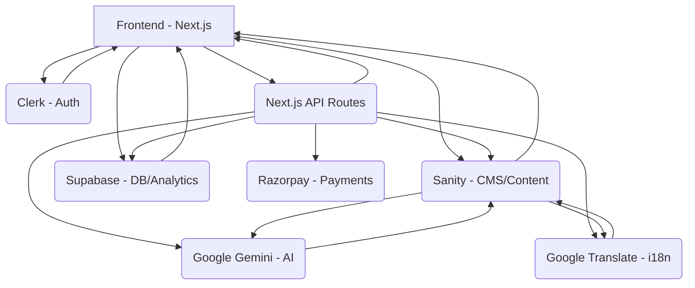

# InfluencerFlow MVP Development Plan - Day 1 Breakdown

Based on the "Day 1: Foundation & Authentication" section of the main development plan, the tasks are broken down into smaller, actionable steps.

## 📅 DAY 1: Foundation & Authentication

**Goal:** Establish the core technical foundation, including project setup, authentication, CMS integration, database setup, and initial external service configurations.

### ☀️ Morning Tasks: Project Setup, Authentication, and CMS

*   **Task 1.1: Project Initialization**
    *   Initialize a new Next.js 14 project with TypeScript.
    *   Install core dependencies: React, Next.js, TypeScript.
    *   Install styling dependencies: Tailwind CSS.
    *   Configure Tailwind CSS within the Next.js project.
    *   Install authentication dependency: Clerk.
    *   Install CMS dependency: Sanity.
    *   Install database client dependency: Supabase client library.
    *   Install Google API client libraries (or relevant wrappers) for Translate and Gemini.
    *   Set up `.env.local` file for environment variables (API keys, connection strings, etc.).

*   **Task 1.2: Clerk Authentication Setup**
    *   Create a new application in the Clerk dashboard.
    *   Integrate Clerk into the Next.js application using provided hooks and components.
    *   Implement basic login and signup pages/components using Clerk's pre-built UI or headless components.
    *   Configure Next.js middleware to protect routes requiring authentication.

*   **Task 1.3: Sanity CMS Setup**
    *   Create a new Sanity project.
    *   Set up the Sanity Studio within the Next.js project.
    *   Define initial core schemas in Sanity:
        *   `creator` schema (basic fields like name, categories, languages, audience size).
        *   `campaign` schema (basic fields like name, description, status, associated creators).
        *   `contractTemplate` schema (basic fields for template content, language).

### 🌤️ Afternoon Tasks: Data Integration and Basic UI

*   **Task 1.4: Next.js Integration with Sanity**
    *   Configure the Sanity client in the Next.js application for fetching data.
    *   Create basic API routes (e.g., in `src/app/api/sanity/`) to handle data fetching from Sanity.
    *   Implement basic data retrieval (Read operations) for the `creator`, `campaign`, and `contractTemplate` schemas via the Sanity client or API routes.

*   **Task 1.5: Supabase Database Setup**
    *   Create a new project in the Supabase dashboard.
    *   Create necessary tables in the Supabase database:
        *   `transactions` table (fields for payment status, amount, related campaign/contract).
        *   `performance_metrics` table (fields for tracking campaign performance data).
        *   `activity_logs` table (fields for logging system activities, e.g., outreach attempts).
    *   Configure basic Row Level Security (RLS) policies for these tables to ensure data protection.

*   **Task 1.6: Basic UI Components**
    *   Create foundational UI components using Tailwind CSS.
    *   Develop a basic application layout (e.g., header, main content area, potentially a simple footer).
    *   Implement a placeholder component for language switching (the actual logic will be added later).

### 🌙 Evening Tasks: External Service Configuration

*   **Task 1.7: Google Services Setup**
    *   Set up a project in the Google Cloud Console.
    *   Enable the Google Translate API for translation services.
    *   Enable the Google Gemini API for AI capabilities.
    *   Generate API keys for both services and add them to the `.env.local` file.
    *   Create utility functions or service classes in the Next.js project to interact with the Google Translate and Gemini APIs.
    *   Write basic test calls to both APIs to ensure connectivity and functionality.

### ✅ Day 1 Deliverable:

An authenticated Next.js application with established connections and basic data models in Sanity CMS and Supabase, and configured access to Google Translate and Gemini APIs.

---

### Architecture Overview (from original plan)

---

This plan breaks down Day 1 into smaller, more manageable tasks.