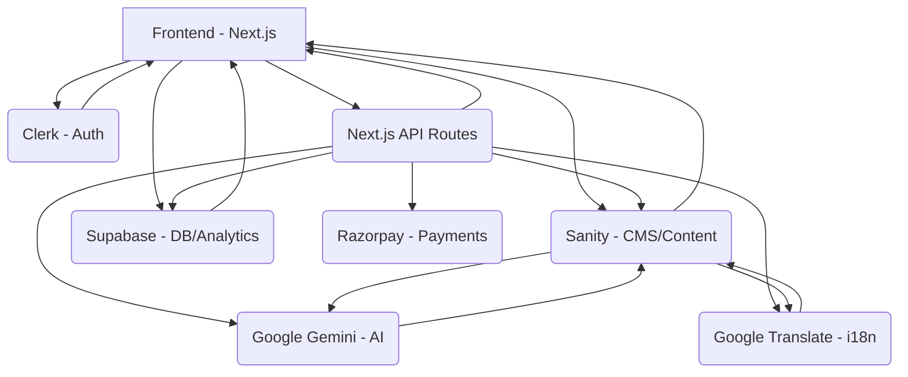

# InfluencerFlow MVP Development Plan

## 1. Project Goal & Scope

*   **Goal:** To build a functional Minimum Viable Product (MVP) of the InfluencerFlow AI Platform within 3 days, demonstrating the core end-to-end workflow of campaign creation, creator discovery, AI outreach, contract generation, basic payment processing, and performance tracking.
*   **Scope:** The MVP will focus on the essential features required to showcase the automated workflow with bilingual support (English and Hindi). Specific scope limitations for the MVP include:
    *   **Digital Signature:** A visual placeholder and basic status tracking in the backend will be implemented. Full e-signature integration is deferred.
    *   **Performance Dashboard:** Real-time performance data display is required, but initial social media API integrations may be mocked or simplified for the 3-day timeline.
    *   **Payments Module:** Only Razorpay integration will be implemented for the MVP. Stripe integration is deferred.
    *   **Language Support:** Limited to English and Hindi.
    *   **AI Capabilities:** Focus on Gemini for recommendations, outreach personalization, and basic reporting. Advanced analytics and predictions are deferred.

## 2. Key Features (MVP Implementation)

*   **Creator Discovery Engine:**
    *   Searchable database of creators (populated with sample data).
    *   Filtering by category, language, and audience size.
    *   Gemini-powered prompt-based search and creator recommendations.
    *   Bilingual creator profiles (English/Hindi).
*   **AI Outreach & Negotiation System:**
    *   Automated email outreach in English & Hindi using Google Translate.
    *   Gemini-powered message personalization and basic negotiation capabilities (simulated or basic responses).
    *   CRM-style communication logging in Sanity.
    *   Language preference detection and switching for communication.
*   **Contract Automation:**
    *   Template-based contract generation (English/Hindi).
    *   PDF generation of contracts.
    *   *Visual placeholder for digital signature.*
    *   Contract status tracking in Sanity CMS.
*   **Payments Module:**
    *   Milestone-based payout flow (basic implementation).
    *   Payment dashboard displaying transaction status.
    *   *Razorpay integration for payment processing (test mode).*
    *   Transaction logging in Supabase.
*   **Campaign Tracker & Performance Dashboard:**
    *   Interface for tracking campaign status.
    *   *Real-time performance data display (potentially using mock data or simplified integrations).*
    *   Basic analytics visualization.
    *   Gemini-powered automated reporting (basic).
    *   ROI calculations (basic).
*   **Admin Panel:**
    *   Platform management via Sanity Studio.
    *   User management (leveraging Clerk + Sanity).
    *   Campaign oversight.
    *   Content management for templates.

## 3. Technology Stack

*   **Frontend:** Next.js 14 (TypeScript), Tailwind CSS
*   **Authentication:** Clerk
*   **Backend/CMS:** Sanity CMS (primary backend), Supabase (transactions, analytics, logs)
*   **AI/ML:** Google Gemini
*   **Translation:** Google Translate API
*   **Search:** Sanity's built-in search + Gemini embeddings
*   **Payments:** Razorpay
*   **Deployment:** Vercel (Frontend), Sanity Cloud, Supabase Cloud, Clerk Cloud

## 4. Development Plan (3 Days)

*   **📅 DAY 1: Foundation & Authentication**
    *   **Morning:** Project setup (Next.js, dependencies, environment variables), Clerk authentication setup (account, integration, login/signup, protected routes), Sanity CMS setup (project, studio, core schemas: Creator, Campaign, Contract Template).
    *   **Afternoon:** Next.js integration with Sanity (client setup, API routes, basic CRUD), Supabase setup (project, tables: transactions, performance_metrics, activity_logs, RLS), Basic UI components (Tailwind config, layout, language switcher).
    *   **Evening:** Google Services setup (Translate API, Gemini API, testing, utility functions).
    *   **Deliverable:** Authenticated app with working CMS and database connections.

*   **📅 DAY 2: Core Features & AI Integration**
    *   **Morning:** Creator Discovery Engine (profile pages, Sanity search, filter, creator cards, sample data), Gemini AI Integration (service setup, prompt search, matching algorithm, testing).
    *   **Afternoon:** Campaign Management System (creation form, dashboard, status tracking, detail pages, creator selection), AI Outreach System (email templates, Google Translate integration, Gemini personalization, automation workflow, logging in Sanity).
    *   **Evening:** Language Implementation (Next.js i18n routing, language context/hooks, switching functionality, testing bilingual content).
    *   **Deliverable:** Working creator discovery with AI search and automated outreach system.

*   **📅 DAY 3: Contracts, Payments & Performance**
    *   **Morning:** Contract Automation (template system, PDF generation, *digital signature placeholder*, status tracking, management interface), Payment Integration (*Razorpay setup*, processing workflow, milestone payouts, payment dashboard, transaction logging in Supabase).
    *   **Afternoon:** Performance Dashboard (*Real-time data display*, basic visualization, Gemini reporting, ROI calculation, *mock social media API integrations*), Admin Panel (Sanity Studio config, user management, system monitoring, content moderation).
    *   **Evening:** Final Integration & Testing (end-to-end workflow, bug fixing, optimization, cross-browser testing), Demo Preparation (sample data, demo campaigns, scripts, deployment to Vercel, production config, monitoring setup).
    *   **Deliverable:** Complete MVP ready for demonstration.

## 5. Architecture Diagram

## 6. Key Considerations & Risks

*   **Time Management:** The 3-day timeline is aggressive. Prioritize core functionality and defer non-essential polish.
*   **API Rate Limits:** Implement caching and request batching for Google services.
*   **Translation Quality:** While Google Translate is used, Gemini post-processing will help, but manual review of key phrases might be necessary for critical communications.
*   **Integration Complexity:** Have fallback plans if specific integrations (e.g., Razorpay webhooks) prove more complex than anticipated within the timeframe.
*   **Data Population:** Creating sufficient realistic sample data for creators and campaigns is crucial for a convincing demo.

## 7. Success Criteria (MVP)

*   A working version of the platform demonstrating the end-to-end campaign lifecycle (search → outreach → deal → contract → payment → report) using mock or live data.
*   Core functional requirements listed in the plan are met.
*   Technical requirements (API integrations, bilingual rendering, auth, DB) are functional.
*   Demo readiness checklist is completed.